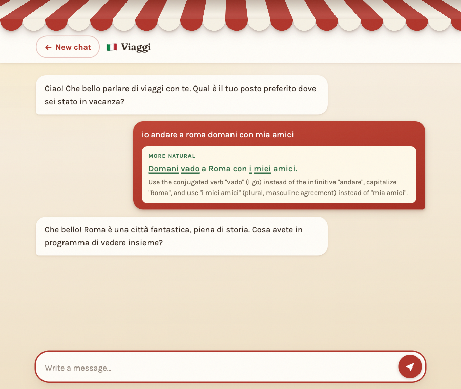
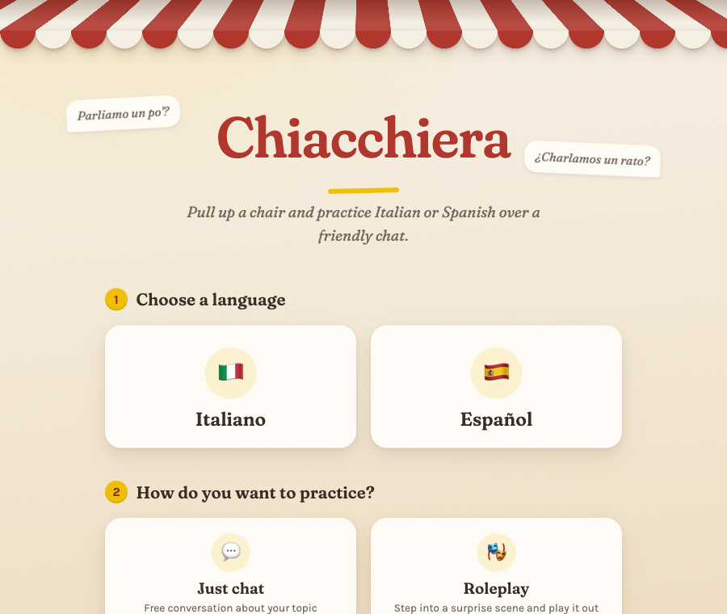
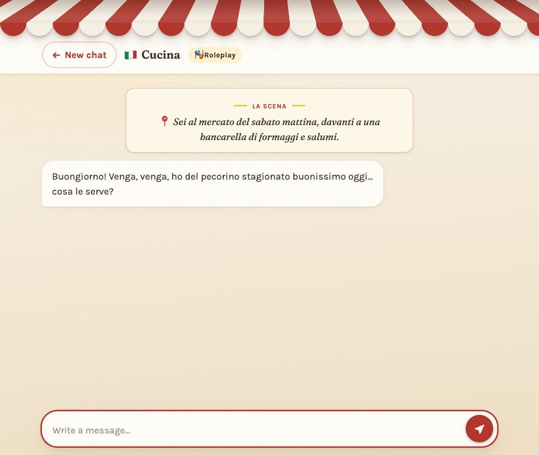
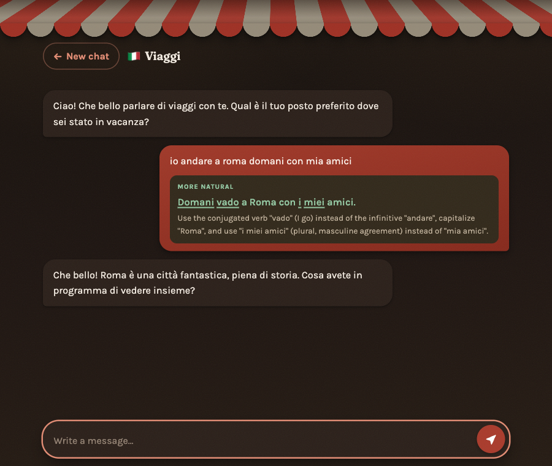

# Chiacchiera 🇮🇹🇪🇸

**Learn by chatting** — practice Italian or Spanish in a natural conversation with an LLM that gently corrects you as you go.

Pick a language, a mode, and a topic, and start talking. Chat freely, or step into a **roleplay** — the assistant invents a surprise scene (a job interview in Milan, a market stall haggle) and plays a character in it. The assistant always replies in your target language and keeps the conversation flowing. Every message you send gets a *teacher's green-ink note* inside your own chat bubble: the correct, natural way to say what you meant — with the exact words that changed underlined. Write in English and the note becomes a translation instead.



## Features

- **Two languages** — Italian and Spanish, selectable per conversation.
- **Two modes** — *Just chat* (free conversation) or *Roleplay* (the assistant invents a concrete scene within your topic and stays in character).
- **Scene cards** — a roleplay's stage direction renders as a centered "La scena" card above the dialogue instead of inside a chat bubble; scene twists mid-conversation get cards too.
- **Topic-based conversations** — 10 starter topics (travel, food, daily life, work, hobbies, movies & music, family, sports, romance, games). The conversation starts the moment you've picked language, mode, and topic.
- **Corrections with word-level diffs** — your message is compared against the corrected version and only the words that actually changed are underlined. Pure capitalization or punctuation fixes are ignored, and full translations of English sentences skip underlining entirely.
- **Explanations in English** — each correction comes with a one-line grammar note.
- **Streaming replies** — assistant responses render token-by-token.
- **Session persistence** — the active conversation is stored in `localStorage`; reload the page and you're back where you left off. "New chat" clears it.
- **Dark mode** — follows your system preference automatically.
- **Responsive** — works from a 360 px phone up to desktop. Reduced-motion preferences respected.

## Screenshots

| Start screen | Roleplay scene card | Dark mode |
|---|---|---|
|  |  |  |

## Quick start

Requires Node.js 18+ and an [Anthropic API key](https://console.anthropic.com/).

```bash
npm install
cp .env.example .env     # then paste your Anthropic API key into .env
npm start
```

Open http://localhost:3000.

Set `PORT` in `.env` to use a different port. Your API key stays on the server — it is read from `.env` (which is gitignored) and never sent to the browser.

## How it works

```
browser (public/)  ──POST /api/chat──▶  Express (server.js)  ──▶  Anthropic API
   vanilla JS      ◀──NDJSON stream──                             claude-sonnet-5
```

- The frontend is plain HTML/CSS/JS — no framework, no build step. Conversation history lives client-side and is sent in full with each request, so the server is stateless.
- The server calls Claude with a `correction` **tool**: the conversational reply streams back as plain text (so it renders token-by-token), then the model calls the tool once with `correction` (corrected/translated version of your message, `null` if it was already right) and `correctionNote` (short English explanation). Structured feedback without fragile JSON-from-prose parsing.
- Responses stream back as NDJSON events: `delta` lines carry the reply text as it's generated, and a final `done` line carries the authoritative payload including the correction.
- In roleplay mode the model opens with a parenthetical scene-setting line; the frontend splits it off and renders it as a scene card above the in-character bubble.
- The word-diff underlines are computed client-side with a longest-common-subsequence over normalized tokens (lowercased, punctuation stripped).

### API

`POST /api/chat`

```jsonc
// request
{
  "language": "italian",            // or "spanish"
  "mode": "roleplay",                // or "chat" (default)
  "topic": "Travel",
  "messages": [                      // full history; [] asks the assistant to open
    { "role": "assistant", "content": "Ciao! ..." },
    { "role": "user", "content": "io andare a roma domani" }
  ]
}

// response: application/x-ndjson
{"type":"delta","text":"Che bello"}
{"type":"delta","text":"! Roma è..."}
{"type":"done","reply":"...","correction":"Domani vado a Roma...","correctionNote":"Use \"vado\"..."}
```

Validation failures and pre-stream errors return plain JSON with 400/500 status codes.

## Project structure

```
server.js            Express server + Anthropic streaming proxy
public/
  index.html         both screens (start + chat)
  app.js             chat flow, streaming reader, word diff, localStorage
  style.css          "Al tavolino" café theme (awning, scene cards), dark mode, animations
docs/
  superpowers/specs/ original design document
  screenshots/
```

## Privacy note

Conversations are only stored in your own browser's `localStorage` and sent to the Anthropic API for generating replies. The server keeps nothing.
